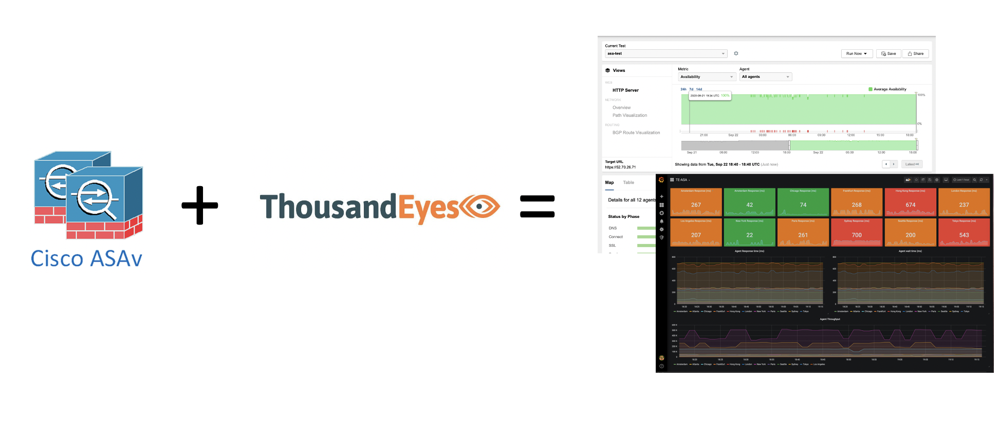
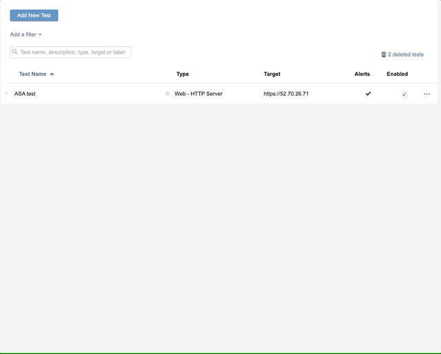

# ASA VPN monitoring with ThousandEyes

In 2020 providing remote access to users and building out a solid VPN infrastructure has become absolutely mission critical. The challenge for IT organisations is how do they look to provide better monitoring and assurance of these infrastructures, particuarly when users are accessing from networks and devices which the organisation may not actually own or be able to manage.

In order to help with this, we've [previously looked at VPN utilisation monitoring](https://github.com/sttrayno/ASA-Telemetry-Guide) using off the shelf tools such as pyATS and the TIG stack to monitor the current state of the actual ASA and it's current metrics on VPN utilisation. This was popular at the time so I thought it might be time to build on this a little more from a different perspective.



In this guide, we're going to attempt to expand on this topic of ASA monitoring, by looking to encorporate the ThousandEyes platform in order to monitor the availability of ASA's further for checking access of other metrics such as availability and packet loss to the ASA over the internet. For those who aren't familiar with ThousandEyes, ThousandEyes was aquired by Cisco in August 2020 - it specialises in monitoring the avialability and performance across networks which you don't own or manage, such as public clouds or the internet. ThousandEyes is an extremely powerful platform for being able to not only understand when faults are happening but also pinpoint exactly where in the network and what's going wrong. Take for example an outage in a specific ISP or a network issue in a specific region within the public cloud, it's these exact issues which ThousandEyes looks to be able to provide more situational awareness for. As many organisations are looking to deploy ASA's for VPN access that are accessible for employees at home over the internet, ThousandEyes will compliment our existing monitoring well from an outside in point of view.

Imagine a scenario where a user calls into the helpdesk and complaining of not being able to access a VPN, a familiar scenario to many. Dashboards and tools such as this will allow your organisation to quickly get a view on if this is an isolated user issue or if theres something wider on the internet which is impacting connectivity.

Please note, the products and techniques used in this guide are suitable and avialable in a way that can be used for companies of all sizes aslong as you have an ASA and ThousandEyes. It should also be said that this should be possible with other remote access VPN solutions also as long as ThousandEyes has support to build a test for it (HTTP in this case) you shouldn't have too much of an issue using the monitoring techniques discussed in this guide.

### Setting up a ThousandEyes test

### Prerequsite #1 - ThousandEyes account

If you've got access to a ThousandEyes account great, you can skip this step. If you do not, fortunately as it stands you can register for a 15 day trial of ThousandEyes if you'd like to get started. To do this go to the [ThousandEyes site](https://www.thousandeyes.com) and click on the "request free trial button". Once you register and provide the required details you should then be taken to the ThousandEyes dashboard.

### Prerequsite #2 - An ASA with remote access configured

Ofcourse, as we are monitoring an ASA we'll need one of these configured and ready to provide remote access, now I'm not going to go into this level of detail within this guide. However here's some resources which may help you get up and running if you aren't already:

* ASA 9.0 Configuration guide - https://www.cisco.com/c/en/us/td/docs/security/asa/asa90/configuration/guide/asa_90_cli_config/vpn_remote_access.html
* Step-by-step guide on configuring Remote access VPN on ASA - https://networklessons.com/cisco/asa-firewall/cisco-asa-remote-access-vpn
* An Ansible playbook built to automate ASA remote access deployment - https://github.com/sttrayno/ASAonAWS-Ansible-Deployment

Your ASA will need to be accessible by the internet for this guide, in this scenario I'm going to track reachability on port 443.

### Building a ThousandEyes test

The first thing we have to do in ThousandEyes is to create a test to run and monitor our ASA device. When you login to ThousandEyes you should be directed to the main dashboard, From here you can configure your tests you wish to run. To do this navigate to "test settings" under "Cloud and Enterprise Agents" and select "Add New Test" a menu should then pop up allowing you to customise the different kind of test's you can run. For now we're going to stick with the default "HTTP Server"

Give your test a name and where it asks for a URL specify the internet accessible IP address of your ASA (This can be a FQDN or an IP address, if you provide a FQDN an extra level of DNS testing data will be provided). 


You'll see an option for the agents you wish to run this test on, select a few agents here, I'd recommend choosing one from each region. These agents are the default cloud agents which are available in the ThousandEyes trial, to learn more head down to the "Types of test" section to read into the different types of test that are available.

Note: At the time of writing within the TE trial period, there are 29 agents available you can only run a single test on each Agent. Pick a few so you get a nice wide dataset.

You will also see an option to select the alerts you recieve, for now I'd leave this at the default and check all of them.


When you're done, select "Create New Test" and it should be created within a few seconds, select on the test you've just created and you should see a button for "Run Once" select that and give TE a few minutes to run its tests. It should return an example view as we've got below.


Congratulations, you've just created your first test in ThousandEyes, take some time to explore the types of tests and the advanced settings to get a feel for how you could customise the testing scenarios for your exact environment.


### Disabling SSL validation (Optional)

In this example, as I don't have a valid certificate on my ASA. Therefore when my tests run I get an availability fail as the certifcate is invalid, to get round this error I can disable SSL validation under the "advanced settings" by unchecking "Verify SSL certificate".



### Types of test

In the ThousandEye platform there are different types of agents which we can run tests on, each of these have different advantages and considerations which will dictate what you use. A quick explanation of the most popular tests:

* Cloud Agents - These are the agents in which we ran our test in the first section of the guide, cloud agents are managed and maintained by ThousandEyes which allow you to test availablility and performance from multiple different geos, clouds and ISP's. In the free trial there are 29 different agents available to run tests on. In the full paid version there are nearly [200 cities globally](https://www.thousandeyes.com/product/cloud-agents).

* Enterprise Agents - These are agents you deploy on your own infrastructure, this is by far the most flexible method of deployment and there's many options for installing the agent including OVA, Docker container and installable package. You will have to manage these agents yourself as an adminstrator however they give great flexibility in terms of being able to run pretty much anywhere you require.

* Endpoint Agents - These are deployed on the end-users actual device, this can be installed on a browser (Edge, Chrome or Firefox) or on the OS (MacOS or Windows). These provide a major advantage of being able to track the users actual experiences, across multiple devices, ISPs and physical locations. The drawback being is you have to manage the install of the agents to user machines, which in large environments can be tricky.

You can decide if any of the agents outlined above may suit your environment better, it might be possible for you to distribute the endpoint agent to user machines which will provide a more respresentative view of user experience. However this will add a level of complexity so it's a trade-off.

It is important to note that our example is using agents from all round the world, now in a proper production scenario this probably isn't something you'd do as you'd likely have VPN gateways all over the world to accomodate your users. As I'm working with just one ASA, situated in AWS us-east-1 this isn't going to be necessarily a representative deployment but we are limited by scale and the available sensors in the ThousandEyes trial account, in a proper deployment you'd have a lot more options to deploy and use agents more representative of your scenario or agents on the endpoint itself to give a view of situations such as poor employee connectivity or ISP outages.

### Visualisation and Alerts

Within the stock ThousandEyes platform there is the dashboard screen, from here you can build custom views to check on the status of your tests and build out charts to allow you to track the key metrics you need. Such as the examples below: 


As you can see there are a selection of graphs and different visualisation methods for building out simple dashboards for multiple different scenarios. However there are some limitations with the visualisation as you'll typically have a limit of 30 days which means long term visualisation and data storage can be an issue. We'll go onto address this in the next section.

Within ThousandEyes when you configure your tests you can also set the alerts that you wish to be notified when a test 'fails' by default this will send an email to you however you can tweak based on your exact requirements.

## Advanced visualisations with Grafana

If you're set up with some basic visualisations and alerts from the last step and you're happy you can probably stop reading now. However in the case that the stock alerting and visualisation in the ThousandEyes platform isn't enough for you or you need to have a more historical view of information over 30 days, we can also use open source tools such as Grafana, part of the TIG stack to build more custom visualisations. As the data in ThousandEyes is all available through a REST API it's a fairly straight forward process. However to get our data into a stack such as TIG we'll need to start digging into the API.

#### Step 1 - Installing Docker

First off we'll need an environment with the TIG stack installed that we can use, for this guide I'll use a Docker container to automate much of this process. If you already have docker installed you can proceed to Step 2 and start to pull down the containers required. If you do not have docker installed you can consult the docker documentation here

Alternatively you could install the TIG stack on your own system, they are numerous guides on how to do this online. For completeness we'll walk through all the steps here.

#### Step 2 - Setup our TIG stack

Thankfully, Jeremy Cohoe has created a fantastic docker container with all the needed components preinstalled. You can pull the container from the Docker hub with the following shell command.

```
docker pull jeremycohoe/tig_mdt
```

Let that pull down the required image from Docker hub then run the following command to start the container.

```
docker run -ti -p 3000:3000 -p 57500:57500 jeremycohoe/tig_mdt
```

As this docker container wasn't fully built for what we're looking to do we need to do some further configuration. To do this, from your shell use the command `docker ps` to display your container id. Take the containerid value which should be 12 digit alphanumeric string and then use the command `docker exec -it <CONTAINER ID HERE> /bin/bash` . Once you do that you should have root prompt for your container.


Now we're in use the following commands to install the necessary components and packages, run these one after the other

```bash
apt-get update && apt-get upgrade
apt-get install python3
apt-get install python3-pip && apt-get install python3-venv
apt-get install git
```

Now create some directories we'll use later

```bash
mkdir /opt/telegraf
cd /opt/telegraf
```

Next we're going clone this repo into the folder and create a python virtual environment. A Virtual Environment acts as an isolated working copy of Python which allows you to work on a specific project without worry of affecting other projects. It is strongly recommended that you use this as it creates an isolated environment for our exercise which has its own dependencies, regardless of what other packages are installed on the system.

```bash
git clone https://github.com/sttrayno/ASA-TE-Monitoring.git
python3 -m venv env3
source env3/bin/activate
```

Finally install the Python package requirements with the pip command.

```bash
pip install -U pip
pip install requests
```

In this example we're going to take the results from the http-server API call. You can customise this to visualise whatever data you would like to visualise within Grafana, for this you'll need to explore the API to see what you can sucessfully query you can find the documentation [here](https://developer.thousandeyes.com/v6/test_data/) Once you get the response its then a matter of parsing it as required and printing the data out to the console. Telegraf will then do the rest in the following steps. You can see an example script below and some additional scripts in the 'code' folder of this repo.

Please note: you will have to add your own TEST_ID and Auth token to this script for it to work. You can find your auth bearer token from the "Account Settings > Users and Roles" page under the “Profile” tab, in the “User API Tokens” section. To get your test_ID you can find this in the URL under views. For example the `https://app.thousandeyes.com/view/tests/?roundId=00000001&metric=availability&scenarioId=httpServer&testId=1694485` would have a test_ID of 1694485.

```python
import requests
import json

test_id = "<INSERT YOUR TEST_ID HERE>"

te_endpoint = "https://api.thousandeyes.com/v6/web/http-server/" + test_id + ".json?headers=1&certificates=1"

payload = {}

headers = {
  'Authorization': 'Bearer <INSERT YOUR AUTH TOKEN HERE>'
}

r = requests.request("GET", te_endpoint, headers=headers, data = payload)

r = json.loads(str(r.text))

x = 0

testData = {}

while x < len(r['web']['httpServer']):
    agent = {}
    agentName = r['web']['httpServer'][x]['agentName']
    agent['throughput'] = r['web']['httpServer'][x]['throughput']
    agent['responseTime'] = r['web']['httpServer'][x]['responseTime']
    agent['waitTime'] = r['web']['httpServer'][x]['waitTime']
    x += 1
    testData[agentName] = agent

print(json.dumps(testData))
```

Once you've configured your environment all that is left to do is now test to see if things are working. Try running the following command from the shell which will test using our collection script.
```
/opt/telegraf/env3/bin/python /opt/telegraf/ASA-Telemetry-Guide/telegraf/scripts/asascript.py
```


#### Step 3 - Configure Telegraf and Build Dashboards

Now that we can get data from the ThousandEyes, let's get the data into InfluxDB and start building some visuals.

First off if the directory `/etc/telegraf/telegraf.d` doesn't already exist create it, and copy the `custom.conf` file in the telegraf folder over to `/etc/telegraf/telegraf.d/custom.conf`

```bash
cp /opt/telegraf/ASA-Telemetry-Guide/telegraf/custom.conf /etc/telegraf/telegraf.d/custom.conf
```


If you `cat custom.config` you will see the contents, all this does is take our ThousandEyes script from the last example and runs this every minute to collect the metrics from our tests by using our example Python script. You can run multiple of these custom.config files, just put them in the telegraf.d directory and give them another name that makes them easy to identify. You may have multiple for different tests or multiple ASA's

```
[[inputs.exec]]
 command = "/opt/telegraf/env3/bin/python /opt/telegraf/ASA-TE-Monitoring/code/te.py"
 data_format = "json"
 name_suffix = "TE_test_data"
 interval = "1m"
              
```

When telegraf starts this will invoke our python script we tested in the last step and send this output to our InfluxDB. You should have tested that the script will run in your environment before getting to this stage to do this please run the command `/opt/telegraf/env3/bin/python /opt/telegraf/ASA-TE-Monitoring/code/te.py` in your terminal, if it errors out go back to step 2 before proceeding.

All that's left to do now is start the telegraf service, or if it's already running stop and start again. This can be done on an Ubuntu system with the command `service telegraf stop/start` like the graphic above.

By now we should have some data in our InfluxDB to display. The next step from here is to login to Grafana and configure our dashboard to do this navigate to grafana on http://localhost:3000 and login (if you're using the container above the username/password is admin/Cisco123).

First thing you should do is configure a data source, you can do this by looking for the gear icon on the left hand side selecting data sources and choose add data source, then select the InfluxDB icon, you will then be taken to a configuration screen Make sure you mirror the configurations below:


Important: Make sure you name the database `InfluxDB-asa`, as the pre-configured dashboard we're about to use will reference this source name. Ensure the InfluxDB database that's being referenced is also telegraf as shown in the graphic below.

Once that runs and the connection test is successful it's then time to upload the .json file included in the Grafana directory of this repo, this should build the custom graphs we've built that will be populated with the data you are collecting from your own ASA environment.

To do this:

1. Hover over the grey '+' on the left hand taskbar and select Dashboard
2. From there select New dashboard from the top of the screen
3. Click Import dashboard from the next screen.
4. You should then be prompted to upload your json file which can be found in this repo.


Congratulations, you've now went through a worked example to create some visualisations from the data ThousandEyes provides in Grafana. From here you could now look to follow our [previous](https://github.com/sttrayno/ASA-Telemetry-Guide) to look at getting device metrics in conjunction with these availability and performance numbers.
